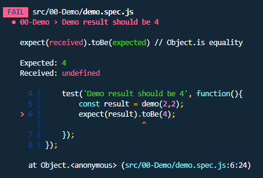
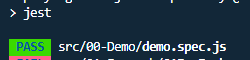

# Playing with Javascript Arrays

In this practical tutorial you will learn/practice the different methods that javascript offers to work with arrays.

## Table of contents
- [Requirements](#Requirements)
- [Preview concepts](#Preview-concepts)
    - [Javascript](#Javascript)
    - [Array](#Arrays)
    - [Jest](#Jest)
    - [TDD](#TDD)
- [How it works](#How-it-works)
- [Tutorial](#Tutorial)
    - [00 Demo](#00-Demo)
    - [01 Foreach](#01-ForEach)

## Requirements

- NodeJS
- NPM
- Basic terminal knowledge
- Basic Javascript knowledge

## Preview concepts

### Javascript

> JavaScript is a scripting or programming language that allows you to implement complex functions in web pages, every time a web page does more than just sit there and display static information for you to see, it displays timely content updates, interactive maps, 2D/3D graphics animation, moving video playback machines, etc., you can bet that JavaScript is probably involved.

### Array

> Arrays are objects similar to a list whose prototype provides methods for performing routing and mutating operations. Both the length and type of elements in an array are variable. Because the length of an array can change at any time, and data can be stored in noncontiguous locations, there is no guarantee that JavaScript arrays are dense; this depends on how the programr chooses to use them.

### Jest

> Jest is a JavaScript test runner, that is, a JavaScript library for creating, running, and structuring tests.

> Jest ships as an NPM package, you can install it in any JavaScript project. Jest is one of the most popular test runner these days, and the default choice for React projects.

### TDD

> TDD or Test-Driven Development is a programming practice that consists of writing the tests first (usually unit), then writing the source code that passes the test successfully, and finally refactoring the written code.

> This practice achieves, among other things: more robust, more secure, more maintainable code and faster development.

## How it works

1. Clone github repository

```sh
git clone https://github.com/JorgeFi18/playing-with-javascript-arrays.git
```

2. Install NPM depedencies

```sh
npm install
```

3. Run the following command

```sh
npm run test
```

## Tutorial

### 00 Demo

Let's start with a brief demo on how this tutorial works. The goal is to make pass all the test that currently are failing when you run `npm run test`.

We are using jest to run test cases.

```js
/* Basic Jest assert sintax */

test('description of what is tested', function(){
    const value = 1;
    expect(value).toBe(1)
})

```
Each section has their code on the `src` folder organized by folders, the source code for this section is on `src/00-Demo`, you will find two files by each section, one is the javascript file that you should modify, in order to make the test pass and the other with `.spec` keyword is the code of the test statement, please avoid change code on those files.

Jest provide us enough information to see what is happening and what should we change to fix it.

We need to pay atention on the Expeted and Received values.



Also since each report has a kind of heading, in this case `00-Demo > Demo result should be 4` we know where is the issue happening and what is the expected behavior to have success.

In this case the expect value is 4, but we are getting undefined.

We need to go to `src/00-Demo/demo.js` and see what we have.

Surprice! we have a function that is returning anything, let's to change something to make it pass.

We need to return a simple sum of the two variables, our demo function will look like this:

```js
function demo(a,b) {
    return a + b;
}
```

After make this change let's to run again our test script.

We have our first test passin successfuly!



Hope you enjoyed making this first exercise, this will be the dynamic in each section. You will found some resources and examples before to find a written explanation on what you should make in each section.

### 01 ForEach 

The `forEach()` method executes a provided function once for each array element.

**Syntax**

```js
arr.forEach(callback(currentValue, index, array) {
    // execute something
})
```

**Example**

```js
const array1 = ['a', 'b', 'c'];

array1.forEach(element => console.log(element));

// expected output: "a"
// expected output: "b"
// expected output: "c"
```

**Challenges**

#1 Shold calculate the total of a numbers array

Using the forEach loop sum every number in the list to the total variable

#2 Items should contain fullName property

Generate a new property in each item of the list, the property you should to create is `fullName`.

The structure of each item is the following:
```json
{
    "name": "John",
    "lastName": "Wick",
    "age": 40
}
```

The expected fullName for this example is: `John Wick`